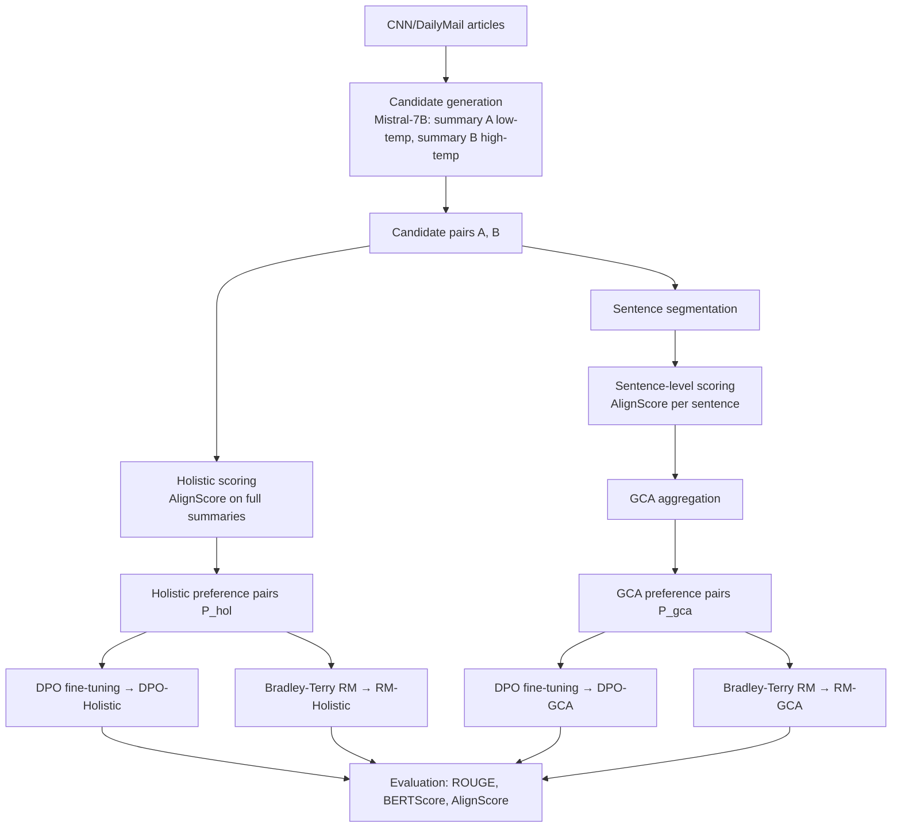

# Meeting Notes — 2 June 2026

**Student:** Muhammad Hasnat  
**Supervisors:** Dr. Zeyd Boukhers, Prof. Dr. Frank Hopfgartner | **Mentor:** Lingxiao Kong

---

## 1. Recap of Previous Meeting (19 May 2026)

Last time we agreed to:
1. Train Bradley-Terry reward models on a dedicated 500-sample set
2. Run DPO fine-tuning on Mistral-7B for both holistic and GCA conditions
3. Evaluate the fine-tuned models against baseline on held-out articles

All three are done. ✅

---

## 2. Introduction

### Motivation

Summarization models often produce fluent but factually unreliable outputs. Standard RLHF uses holistic preference labels ("which summary is better?"), which can miss sentence-level errors. This thesis asks: does applying feedback at the sentence level via **Granular Credit Assignment (GCA)** produce more factually consistent summaries than holistic feedback?

### Architecture

### Key method points

- **GCA:** each sentence is scored against the article with AlignScore, then aggregated with self-weighting so that less-grounded sentences contribute more to the penalty signal.
- **DPO:** trained with LoRA (r=16, α=32) on Mistral-7B-Instruct-v0.3, β=0.1.
- **Bradley-Terry RM:** RoBERTa-base with a mean-pool scalar head, pairwise ranking loss, 5-fold CV.

---

## 3. Progress Since Last Meeting

### What was completed

| Step | Result |
|------|--------|
| 500-sample RM candidate generation | 495 articles, disjoint from DPO set |
| AlignScore preference building (RM set) | 494 holistic pairs, 495 GCA pairs |
| Bradley-Terry RM training | Holistic: **58.1%**, GCA: **54.6%** pairwise accuracy (5-fold CV) |
| DPO fine-tuning | Holistic loss 0.6902, GCA loss 0.6913 |
| Evaluation on 200 held-out articles | See results below |

The RM accuracies are both above chance (50%), but holistic is more consistent. GCA drops near chance in two folds — the sentence-level signal is noisier, which is actually the core thesis finding.

### Evaluation results (n=200, bootstrap 95% CI)

| Condition | ROUGE-1 | ROUGE-L | AlignScore |
|-----------|---------|---------|------------|
| Baseline | 0.3281 | 0.2132 | 0.7965 |
| DPO-Holistic | 0.3255 | 0.2111 | **0.8017 (+0.5%)** |
| DPO-GCA | 0.3255 | 0.2108 * | 0.7996 (+0.3%) |

\* DPO-GCA ROUGE-L is significantly different from baseline (Wilcoxon p=0.015). All other differences are non-significant.

**Key takeaways:**
- DPO-Holistic gives the best factual consistency (AlignScore +0.5pp) — the metric most tied to the thesis goal.
- DPO-GCA produces a statistically significant structural shift (ROUGE-L p<0.05), but a smaller AlignScore gain.
- The 39.5% holistic/GCA disagreement rate confirms the two signals are genuinely different.

### Challenges

- AlignScore and BERTScore needed patches to work offline on the HPC cluster (AdamW removed in transformers v5, HF proxy unreachable from compute nodes).
- One GPU node had a broken CUDA runtime — excluded permanently via Slurm.

---

## 4. Next Steps

**Immediate:**
1. Thesis write-up — results chapter is ready to write
2. Qualitative error analysis on the 39.5% disagreement cases
3. Finalize related work section

**If time permits:**
- DPO β ablation
- Scale DPO to the full 495-sample set

**Open questions for today:**
- Is +0.5pp AlignScore sufficient, or should we add a small human evaluation?
- How to frame the ROUGE-L significance result — positive finding or distribution shift?
- Is the experimental scope sufficient for submission?
