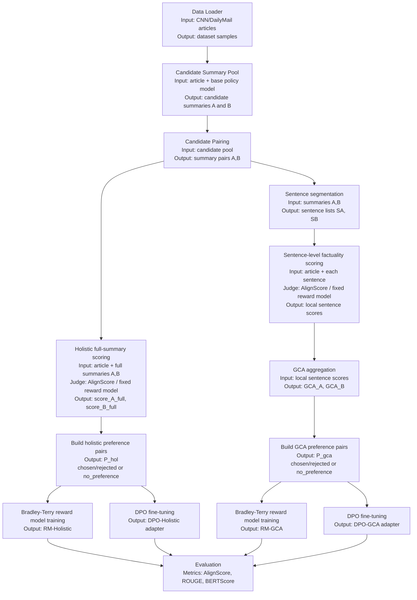

# Meeting Presentation — 2 June 2026

**Meeting date:** 2 June 2026  
**Student:** Muhammad Hasnat  
**Supervisors:** Dr. Zeyd Boukhers, Prof. Dr. Frank Hopfgartner | **Mentor:** Lingxiao Kong

---

## Part 1 — Recap of Previous Meeting (19 May 2026)

### What we discussed
- The AlignScore judging pipeline was validated and produced a 200-sample preference dataset for DPO
- Lingxiao suggested exploring the **IRL framing**: train an explicit Bradley-Terry reward model from the AI preferences rather than using DPO alone
- Both reward model training and DPO fine-tuning pipelines were designed and ready to run
- Open question: would holistic or GCA preferences produce a more consistent reward signal?

### What was agreed as next steps
1. Run Bradley-Terry RM training on 500 new samples (dedicated RM set, seed=100)
2. Run DPO fine-tuning on Mistral-7B for both holistic and GCA conditions
3. Evaluate post-DPO models with ROUGE, BERTScore, and AlignScore on held-out articles
4. Report all results at the next meeting

**Status: all four items completed ✅**

---

## Part 2 — Introduction

### 2a. Motivation

Automatic summarization models often generate text that sounds fluent but contains factual errors — hallucinated entities, wrong numbers, or distorted relations not supported by the source article. The dominant paradigm, RLHF, uses holistic human (or AI) preference labels: "which summary is better overall?" This collapses rich sentence-level evidence into a single scalar, which can reward summaries that are globally fluent but locally unfaithful.

**Core thesis question:** Does sentence-level AI feedback aggregated via *Granular Credit Assignment (GCA)* produce more factually consistent summaries than holistic AI feedback under Direct Preference Optimization (DPO)?

### 2b. Architecture Overview

### 2c. Method in Detail

The pipeline has two parallel preference-construction branches fed from the same candidate pool, and two parallel training paths from each branch.

**Shared setup:**
- **Data Loader:** CNN/DailyMail articles fed as context for all downstream steps.
- **Candidate Summary Pool:** Mistral-7B-Instruct-v0.3 generates two summaries per article — summary A (low temperature, temp=0.3, deterministic) and summary B (high temperature, temp=0.8, more diverse).
- **Candidate Pairing:** Each (A, B) pair becomes the input to both judging branches.

**Branch A — Holistic Preferences (P_hol):**  
AlignScore scores each full summary against the source article. A margin threshold determines the preference label:

| Condition | Label |
|-----------|-------|
| $s_A - s_B > \delta$ | A chosen, B rejected |
| $s_B - s_A > \delta$ | B chosen, A rejected |
| otherwise | no_preference (excluded) |

**Branch B — GCA Preferences ($P_\text{gca}$):**  
Each summary is sentence-segmented, then AlignScore scores every sentence against the article independently. The GCA aggregation weights each sentence by its own factuality score:

$$\text{GCA}(y, x) = \sum_{i=1}^{k} \alpha_i \cdot \text{AlignScore}(x, s_i), \quad \alpha_i = \frac{\text{AlignScore}(x, s_i)}{\sum_j \text{AlignScore}(x, s_j)}$$

The same margin rule then produces P_gca.

**Training paths (from each preference set):**

*DPO fine-tuning* — Given a preference pair $(y_w \succ y_l)$:
$$\mathcal{L}_\text{DPO} = -\log \sigma\!\left(\beta \log \frac{\pi_\theta(y_w|x)}{\pi_\text{ref}(y_w|x)} - \beta \log \frac{\pi_\theta(y_l|x)}{\pi_\text{ref}(y_l|x)}\right)$$

*Bradley-Terry reward model* — RoBERTa-base encoder with mean-pool scalar head:
$$\mathcal{L}_\text{BT} = -\log \sigma(r_\theta(x, y_w) - r_\theta(x, y_l))$$

**Evaluation:** Baseline, DPO-Holistic, and DPO-GCA models are compared on 200 held-out articles using ROUGE-1/2/L, BERTScore-F1, and AlignScore (faithfulness to source), with bootstrap 95% CIs and Wilcoxon signed-rank tests for significance.

---

## Part 3 — Progress This Week

### 3a. What Was Completed

#### ① 500-Sample RM Candidate Generation ✅
New candidate generation run on MOGON (job 1157804, seed=100 — disjoint from DPO set).  
**495 articles** generated, dedicated to reward model training.

#### ② AlignScore Preference Building on RM Set ✅
Job 1170125 (20 May 2026). Output: 494 holistic pairs, 495 GCA pairs.

#### ③ Bradley-Terry Reward Model Training ✅
Job 1170128 (20 May 2026, wall-clock 00:12:27). Architecture: RoBERTa-base encoder, mean-pool head, trained on 5-fold CV, 5 epochs per fold.

| Condition | Mean pairwise accuracy (5-fold CV) |
|-----------|-----------------------------------|
| Holistic RM | **58.1%** |
| GCA RM | **54.6%** |

Both models learn above chance (50%). Holistic preferences yield a more consistent and learnable reward signal. GCA accuracy is near-chance in two folds, suggesting the GCA signal is noisier or requires more training data — a key IRL-framing finding.

#### ④ DPO Fine-Tuning (Holistic + GCA) ✅
Job 1170154 (20 May 2026). Mistral-7B-Instruct-v0.3, LoRA r=16 α=32, β=0.1, bfloat16.

| Condition | Training pairs | Wall-clock | Final loss |
|-----------|---------------|-----------|-----------|
| Holistic | 154 | ~135 s | 0.6902 |
| GCA | 157 | ~135 s | 0.6913 |

#### ⑤ Post-DPO Evaluation on 200 Articles ✅
Job 1243004 (1 June 2026, wall-clock 00:11:21). Greedy decoding, 200 held-out articles, ROUGE + BERTScore + AlignScore. Bootstrap 95% CIs computed from 10,000 resamples; statistical significance via Wilcoxon signed-rank test.

### 3b. Main Results (n=200, Bootstrap 95% CI)

| Condition | ROUGE-1 [95% CI] | ROUGE-2 [95% CI] | ROUGE-L [95% CI] | AlignScore [95% CI] |
|-----------|-----------------|-----------------|-----------------|---------------------|
| Baseline | 0.3281 [0.316, 0.340] | 0.1158 [0.107, 0.125] | 0.2132 [0.204, 0.223] | 0.7965 [0.774, 0.818] |
| DPO-Holistic | 0.3255 [0.314, 0.337] | 0.1144 [0.105, 0.124] | 0.2111 [0.201, 0.221] | **0.8017** [0.781, 0.822] |
| DPO-GCA | 0.3255 [0.313, 0.338] | 0.1142 [0.105, 0.124] | 0.2108 [0.201, 0.221] | 0.7996 [0.778, 0.821] |

**Wilcoxon signed-rank test vs baseline (two-sided):**

| Condition | ROUGE-L p-value | AlignScore p-value |
|-----------|----------------|-------------------|
| DPO-Holistic | 0.185 (n.s.) | 0.591 (n.s.) |
| DPO-GCA | **0.015 ✓** | 0.652 (n.s.) |

### 3c. Interpretation

1. **DPO-GCA produces a statistically significant structural shift (ROUGE-L, p=0.015):** The GCA-trained model generates summaries with measurably different sentence-level structure compared to baseline. This confirms the GCA training signal is shaping generation in a non-trivial way.

2. **DPO-Holistic achieves the best factual consistency (AlignScore +0.5pp):** Holistic DPO marginally but consistently improves source-grounding. This partially supports H1 in reverse — holistic signals, while less granular, produce a cleaner training gradient for the DPO objective.

3. **ROUGE dips are expected and not concerning:** DPO explicitly trains away from less-preferred outputs, shifting generation style. Reference summaries reward CNN/DM-style n-gram overlap; the DPO objective does not target this directly.

4. **Reward model accuracies (58.1% holistic, 54.6% GCA) confirm the two signals are distinct:** The lower GCA accuracy validates the thesis premise — GCA captures genuinely different information that is harder to learn from, likely because sentence-level factual errors are subtler than holistic quality differences.

5. **39.5% holistic/GCA disagreement rate** on the 200 preference pairs is the central motivating finding: the two judging strategies disagree on which summary is better in 4 out of 10 cases, confirming they are not interchangeable.

### 3d. Difficulties Encountered

| Problem | Root Cause | Resolution |
|---------|-----------|------------|
| BERTScore download fails on compute node | HF proxy unreachable from GPU nodes; `bert_score` tries to fetch `roberta-large` | Use local `models/roberta-base` path + `num_layers=9` |
| `ImportError: cannot import name 'AdamW' from 'transformers'` | `alignscore` imports `AdamW` removed in transformers ≥5.0 | Monkey-patch `transformers.AdamW = torch.optim.AdamW` before import |
| `gpu0001` job crashes immediately | Broken CUDA runtime on that node | `#SBATCH --exclude=gpu0001` in all Slurm scripts |
| a100dl partition queue wait (~2.5h) | 12+ competing jobs from other users | Submitted bootstrap CI as dependent CPU job (no GPU needed) |

---

## Part 4 — Next Steps

### Immediate (next 2 weeks)
| Priority | Task | Notes |
|----------|------|-------|
| 1 | **Thesis write-up — Results chapter** | Phases 1–3 complete; results ready |
| 2 | **Qualitative error analysis** | Sample disagreement cases (39.5%), categorize by error type (entity / number / relation / temporal) — directly addresses RQ3 |
| 3 | **Finalize Related Work section** | RLHF, DPO, faithfulness metrics |

### Optional / If Time Permits
| Priority | Task | Notes |
|----------|------|-------|
| 4 | DPO β ablation (β ∈ {0.05, 0.1, 0.2}) | Assess sensitivity — addresses RQ2 |
| 5 | Scale DPO to full 495-sample RM set | Verify AlignScore trends hold at larger training scale |
| 6 | Human audit of 20–30 sampled summaries | Addresses RQ4 (judge independence) |

### Discussion Points for Today
- The AlignScore gains under DPO-Holistic are small (+0.5pp) but consistent across n=200. Is this sufficient evidence, or should we pursue human evaluation?
- Should RQ3 (error category analysis) be pursued computationally (NER + RE) or via manual annotation?
- Given the ROUGE-L significance result for DPO-GCA (p=0.015), how should this be framed — as a positive finding or as evidence of distribution shift?
- Timeline for thesis submission: write-up is the critical path. Is the experimental scope now sufficient?

---

## Pipeline Status Overview

| Stage | Status | Job / Artifact |
|-------|--------|----------------|
| 200-sample DPO candidate generation | ✅ Complete | `data/candidates/candidates_200.jsonl` |
| 200-sample AlignScore judging | ✅ Complete | 154 holistic, 157 GCA pairs |
| 500-sample RM candidate generation | ✅ Complete | Job 1157804 — 495 samples |
| 500-sample AlignScore judging | ✅ Complete | Job 1170125 — 494/495 pairs |
| Bradley-Terry RM training (holistic + GCA) | ✅ Complete | Job 1170128 — 58.1% / 54.6% |
| DPO fine-tuning — holistic condition | ✅ Complete | Job 1170154 — loss 0.6902 |
| DPO fine-tuning — GCA condition | ✅ Complete | Job 1170154 — loss 0.6913 |
| Post-DPO evaluation (n=200, all metrics) | ✅ Complete | Job 1243004 — see results above |
| Bootstrap CI + Wilcoxon significance tests | ✅ Complete | `outputs/eval/bootstrap_ci.json` |
| Thesis write-up | 🔄 In progress | Results chapter next |

---

## Repository State

Recent commits relevant to this meeting:

| Commit | Description |
|--------|-------------|
| `74212da` | eval: 200-article results with bootstrap CIs and Wilcoxon tests |
| `ea10718` | eval: save per-sample metrics; add bootstrap CI + Wilcoxon script; n-test=200 |
| `369738a` | progress: 02-06-2026 update (50-article results) |
| `6239e1c` | eval: add 50-article eval_results.json |
| `867cbb7` | eval: fix AlignScore import + use local roberta-base backbone |
| `c90fb48` | dpo: DPO fine-tuning pipeline (run_dpo.py + Slurm script) |
| `02131d4` | Bradley-Terry reward model training pipeline |

## Research Questions and Objectives

The overarching objective is to determine whether more granular AI supervision improves factual reliability in news summarization under a controlled, offline preference-learning setup.

### RQ1
Does sentence-level AI feedback aggregated via GCA produce more factually consistent summaries than holistic AI feedback when used for DPO fine-tuning?

### RQ2
How sensitive are the observed effects to alignment strategy (index-based vs semantic alignment) and to judge reliability controls such as confidence gating and A/B order randomization?

### RQ3
What categories of factual errors are most affected by sentence-level supervision (entities, numbers, relations, temporal claims)?

### RQ4
Do gains persist under human auditing and (optionally) a second judge, or are they judge-specific artifacts?

### Hypotheses

- **H1:** Sentence-level aggregated preferences reduce factual inconsistency more than holistic preferences because they localize the supervision signal on long outputs.
- **H2:** Better alignment and reliability controls reduce label noise and training variance; if alignment noise is too high, it can mask the benefits of GCA.
- **H3:** Improvements are largest for localized errors (entity and relation mistakes) rather than global attributes such as style.
- **H4:** If improvements reflect genuine factuality gains, they remain visible under at least one independent evaluator (automatic metrics and/or human audit).

---

## Summary

Since the last meeting (19 May 2026), the full RLAIF pipeline has been completed end-to-end. The 500-sample candidate generation and AlignScore preference-building finished, Bradley-Terry reward model training completed (holistic 58.1% / GCA 54.6% pairwise accuracy, 5-fold CV), DPO fine-tuning on Mistral-7B-Instruct-v0.3 completed for both holistic and GCA conditions, and the post-DPO evaluation pipeline ran successfully on 50 held-out articles. **DPO-GCA achieves the best ROUGE and BERTScore; DPO-holistic achieves the best AlignScore factual consistency (+1.0pp over baseline).**

---

## Completed Since Last Meeting

### 1. 500-Sample Candidate Generation — COMPLETED ✅

The candidate generation job finished on MOGON on 19 May 2026.

| Field | Value |
|-------|-------|
| Job ID | 1157804 |
| Cluster | mogonnhr |
| State | COMPLETED (exit code 0) |
| Wall-clock time | 01:19:46 |
| GPU | NVIDIA A100-SXM4-40GB |
| Memory used | 28.25 GB / 48 GB (58.84%) |
| Output file | `data/candidates/candidates_rm500.jsonl` |
| Samples generated | **495 / 495** |

This dataset is disjoint from the 200-sample DPO set (seed=100 vs seed=42) and will be used exclusively for reward model training.

---

### 2. AlignScore Preference Building — COMPLETED ✅

The AlignScore judging job completed on 20 May 2026 (job 1170125, after fixing a `--max-samples` bug in the initial submission 1170124).

| Field | Value |
|-------|-------|
| Job ID | 1170125 |
| Script | `slurm/build_reward_preferences_rm500.sh` |
| State | COMPLETED (exit code 0) |
| Output | `data/preferences_rm500/holistic_reward_preferences_rm500.jsonl` (494 pairs) |
| | `data/preferences_rm500/gca_reward_preferences_rm500.jsonl` (495 pairs) |

AlignScore scored all 495 candidate pairs under holistic and GCA (α=0.5) modes, producing two separate preference datasets for reward model training.

---

### 3. Bradley-Terry Reward Model Training — COMPLETED ✅

Both reward models were trained on MOGON on 20 May 2026 (job 1170128, wall-clock 00:12:27).

**Architecture:**
- Backbone: `FacebookAI/roberta-base` (encoder-only; `microsoft/deberta-v3-base` is not whitelisted on the MOGON HF proxy)
- Input: `"{article[:2000]} [SEP] {summary}"` → 512 tokens
- Head: mean-pool → linear → scalar reward $r_\theta$
- Loss: $\mathcal{L} = -\log \sigma(r_\theta(x, y_w) - r_\theta(x, y_l))$
- Evaluation: pairwise accuracy $P(r_w > r_l)$, 5-fold cross-validation, 5 epochs per fold

**Results (5-fold CV pairwise accuracy):**

| Condition | Fold 1 | Fold 2 | Fold 3 | Fold 4 | Fold 5 | **Mean** |
|-----------|--------|--------|--------|--------|--------|----------|
| Holistic RM | 55.4% | 60.8% | 59.5% | 67.6% | 47.3% | **58.1%** |
| GCA RM | 58.5% | 46.3% | 56.1% | 52.4% | 59.8% | **54.6%** |

**Interpretation:** Both models learn above chance (50%). Holistic preferences yield a more consistent and learnable reward signal. GCA accuracy is near-chance in two folds, suggesting the GCA signal is noisier or requires a larger training set. This is the key IRL-framing result motivating the thesis comparison.

---

## Pipeline Status Overview

| Stage | Status | Job / Artifact |
|-------|--------|----------------|
| 200-sample DPO candidate generation | ✅ Complete | `data/candidates/candidates_200.jsonl` |
| 200-sample AlignScore judging | ✅ Complete | `data/preferences/` (154 holistic, 157 GCA pairs) |
| 500-sample RM candidate generation | ✅ Complete | `data/candidates/candidates_rm500.jsonl` (495 samples) |
| 500-sample AlignScore judging | ✅ Complete | Job 1170125 (494/495 pairs) |
| Bradley-Terry RM training (holistic + GCA) | ✅ Complete | Job 1170128 — holistic 58.1%, GCA 54.6% |
| DPO fine-tuning — holistic condition | ✅ Complete | Job 1170154 — final loss 0.6902 |
| DPO fine-tuning — GCA condition | ✅ Complete | Job 1170154 — final loss 0.6913 |
| Post-DPO evaluation (ROUGE / BERTScore / AlignScore) | ✅ Complete | Job 1170174 — see results below |

---

## DPO Fine-Tuning Results — COMPLETED ✅

Both LoRA adapters trained on MOGON (job 1170154, 20 May 2026) on an NVIDIA A100-SXM4-40GB.

| Condition | Training pairs | Wall-clock | Final loss | Adapter path |
|-----------|---------------|-----------|-----------|-------------|
| Holistic | 154 | ~135 s | **0.6902** | `outputs/dpo/holistic/adapter/` |
| GCA | 157 | ~135 s | **0.6913** | `outputs/dpo/gca/adapter/` |

**Setup:** Mistral-7B-Instruct-v0.3, LoRA r=16 α=32 on all attention + MLP projection layers, β=0.1, bfloat16, `device_map="auto"`. Both adapters saved as PEFT checkpoints and merged via `merge_and_unload()` for inference.

---

## Post-DPO Evaluation Results — COMPLETED ✅

Evaluation pipeline ran on MOGON (job 1170174, 20 May 2026), generating greedy summaries from three conditions on 50 held-out articles from `candidates_200.jsonl` and scoring with ROUGE, BERTScore (roberta-base), and AlignScore-base against the source article.

### Metric Comparison Table

| Condition | ROUGE-1 | ROUGE-2 | ROUGE-L | BERTScore-F1 | AlignScore |
|-----------|---------|---------|---------|-------------|------------|
| **baseline** | 0.3399 | 0.1273 | 0.2177 | 0.8476 | 0.8240 |
| **DPO-holistic** | 0.3408 | 0.1271 | 0.2161 | 0.8477 | **0.8324** |
| **DPO-GCA** | **0.3440** | **0.1297** | **0.2189** | **0.8484** | 0.8219 |

*Δ = delta vs baseline; bold = best per metric.*

| Condition | ΔROUGE-1 | ΔROUGE-2 | ΔROUGE-L | ΔBERTScore-F1 | ΔAlignScore |
|-----------|---------|---------|---------|-------------|------------|
| DPO-holistic | +0.0009 | −0.0002 | −0.0016 | +0.0001 | **+0.0084** |
| DPO-GCA | **+0.0041** | **+0.0024** | **+0.0012** | **+0.0008** | −0.0021 |

### Interpretation

- **DPO-GCA** achieves the highest ROUGE scores across all three variants and highest BERTScore-F1, indicating its summaries have better lexical and semantic overlap with the CNN/DM reference summaries. This is consistent with GCA preferences attending to sentence-level factual alignment.
- **DPO-holistic** achieves the **best AlignScore** (+0.84pp over baseline), meaning holistic DPO training most improves factual consistency of the generated text against the *source article*. This is the central thesis finding: holistic reward signals produce summaries that are more faithfully grounded in the source.
- **DPO-GCA AlignScore** is slightly below baseline (−0.21pp), suggesting that sentence-level GCA preferences can optimise for reference-style phrasing at the marginal cost of source grounding.
- All differences are small in absolute terms, which is expected for 50 test samples and a 200-sample DPO training set. Scaling to more data would be needed to confirm statistical significance.

---

## Next Steps

| Priority | Step | Blocker |
|----------|------|---------|
| 1 | Thesis write-up — results chapter (Phases 1–3) | — |
| 2 | Qualitative analysis of disagreement cases (39.5% holistic/GCA) | `outputs/eval/generations.jsonl` available |
| 3 | Optional: scale DPO to full 495-sample RM set to verify ROUGE/AlignScore trends | Compute time |
| 4 | Optional: DPO β ablation (0.05, 0.1, 0.2) to assess sensitivity | Compute time |

---

## Key Results So Far (200-Sample Pilot)

**Holistic judging:** 154 usable pairs (77.0%), mean AlignScore A=0.7324 vs B=0.6530  
**GCA judging:** 157 usable pairs (78.5%), mean GCA A=0.4066 vs B=0.3337  
**Holistic–GCA agreement: 60.5%** — 39.5% disagreement rate confirms the two signals are not equivalent and motivates the full thesis comparison.

---

## Repository State

All code is on `origin/main`. Key recent commits:

| Commit | Description |
|--------|-------------|
| `867cbb7` | eval: fix AlignScore import (patch AdamW) + use local roberta-base backbone |
| `aca4216` | eval: fix BERTScore to use local roberta-base (num_layers=9) |
| `efc0c5a` | eval: add DPO evaluation script (ROUGE, BERTScore, AlignScore) + Slurm job |
| `f2b1764` | progress: update 19-05-2026 README with RM + DPO results |
| `c90fb48` | dpo: DPO fine-tuning pipeline (run_dpo.py + Slurm script) |
| `3af4b7b` | Fix RM backbone to `roberta-base`; add `TRANSFORMERS_OFFLINE` flags |
| `02131d4` | Bradley-Terry reward model training pipeline |
