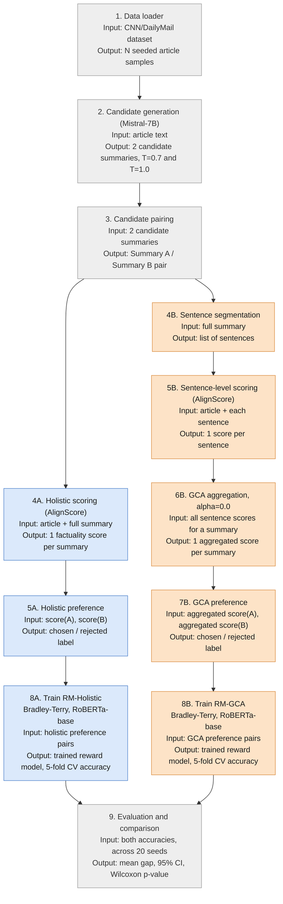
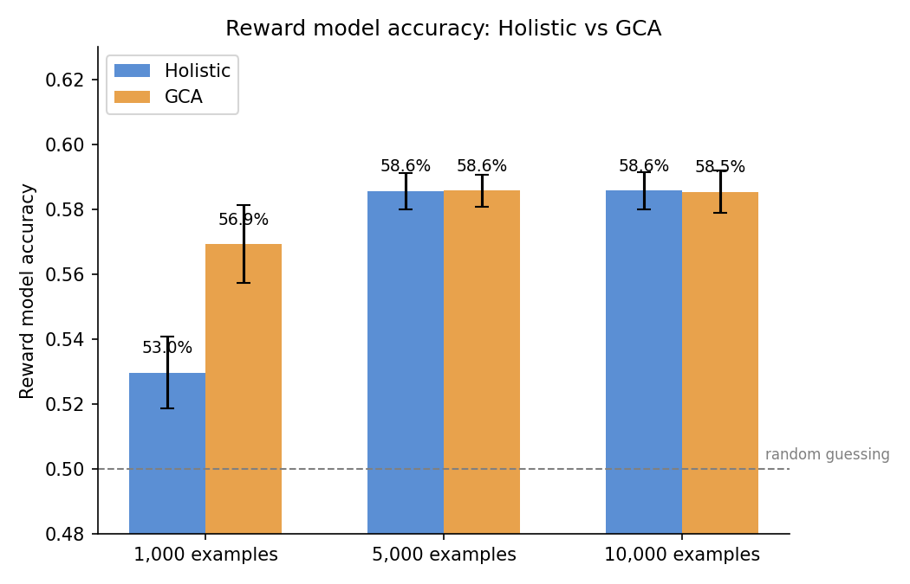

# Progress Update, 11 August 2026

Student: Muhammad Hasnat
Meeting: Tuesday, 11 August 2026

---

## How the experiment works

There are three steps. The diagram below shows the full pipeline end to end,
with what goes into each step and what comes out of it.

Blue boxes are the holistic branch, orange boxes are the GCA branch. Both
branches start from the exact same candidates (grey boxes) and end in the
same evaluation step, so the only thing that ever differs between them is
how the factuality score for each summary is produced. This matches
Figure 5.1 in the thesis (`thesis/chapters/05_implementation.tex`).

Step 1. An AI judge scores the summaries. For each news article, two
candidate summaries were generated. A separate AI model, AlignScore, checks
each summary against the original article and produces a factuality score.
This scoring is done in two different ways:

- Holistic: the AI judge reads the entire summary at once and gives it a
  single score.
- GCA (Granular Credit Assignment): the summary is split into individual
  sentences, the AI judge scores each sentence separately against the
  article, and those sentence scores are combined into one overall score.

Both methods use the exact same AI judge and the exact same summaries. The
only difference is whether the judge looks at the summary as a whole or
sentence by sentence.

Step 2. The judge's scores become training data. Whichever summary
scores higher is marked as the preferred one. This gives two separate sets
of preference labels, one built from holistic scores and one built from GCA
scores.

Step 3. A reward model is trained on each set and compared. A reward
model is a smaller model trained to predict which of two summaries a human
(or in this case, the AI judge) would prefer. One reward model is trained on
the holistic preferences, a second on the GCA preferences. Both are trained
the same way, on the same underlying data. The only thing that differs
between them is which preference labels they learned from.

Accuracy here means how often the reward model correctly guesses which
summary the AI judge had preferred, on examples it was not trained on. 50%
accuracy is what you'd get by guessing randomly.

---

## Results

| Training set size | Holistic accuracy | GCA accuracy | Difference |
|---:|---:|---:|---|
| 1,000 examples | 53.0% | 56.9% | GCA wins by 3.9 points |
| 5,000 examples | 58.4% | 58.2% | no difference |
| 10,000 examples | 58.6% | 58.5% | no difference |

With a small training set, the reward model trained on GCA-style
preferences is clearly more accurate than the one trained on holistic
preferences. With a larger training set, there is no meaningful difference
between the two anymore.

Both bars also get taller from left to right in the chart: accuracy for
both methods improves as the training set grows, which is expected. What
changes is that GCA's advantage over holistic disappears once there is
enough data.

---

## Every individual result

Each number above is an average. Nothing here is from a single lucky run:
every training set size, 1,000, 5,000, and 10,000 examples, was tried 20
separate times, using different random seeds so the runs are genuinely
independent of each other.

### 1,000 training examples (20 runs)

| Run | Holistic | GCA |
|---:|---:|---:|
| 1 | 52.8% | 59.2% |
| 2 | 54.0% | 54.5% |
| 3 | 52.0% | 55.8% |
| 4 | 53.6% | 57.0% |
| 5 | 54.7% | 57.7% |
| 6 | 53.8% | 56.1% |
| 7 | 50.5% | 57.0% |
| 8 | 53.4% | 54.3% |
| 9 | 53.0% | 58.3% |
| 10 | 52.7% | 55.5% |
| 11 | 50.9% | 58.3% |
| 12 | 52.6% | 57.3% |
| 13 | 53.2% | 56.8% |
| 14 | 54.9% | 56.9% |
| 15 | 52.2% | 57.1% |
| 16 | 52.8% | 56.9% |
| 17 | 52.9% | 57.4% |
| 18 | 54.0% | 57.4% |
| 19 | 52.2% | 57.3% |
| 20 | 53.1% | 57.5% |

GCA scored higher than holistic in every single one of these 20 runs.

### 5,000 training examples (20 runs)

| Run | Holistic | GCA |
|---:|---:|---:|
| 1 | 58.5% | 58.3% |
| 2 | 58.6% | 58.8% |
| 3 | 57.6% | 59.1% |
| 4 | 58.5% | 57.8% |
| 5 | 59.4% | 59.1% |
| 6 | 58.7% | 58.3% |
| 7 | 58.3% | 57.6% |
| 8 | 57.8% | 57.9% |
| 9 | 57.6% | 59.3% |
| 10 | 58.7% | 58.4% |
| 11 | 59.0% | 57.3% |
| 12 | 57.7% | 57.2% |
| 13 | 58.9% | 58.4% |
| 14 | 57.4% | 58.1% |
| 15 | 57.7% | 58.4% |
| 16 | 59.4% | 56.5% |
| 17 | 58.5% | 57.8% |
| 18 | 58.6% | 58.5% |
| 19 | 58.9% | 57.9% |
| 20 | 58.5% | 59.3% |

GCA won 7 of these 20 runs and holistic won 13. There is no consistent
winner, just noise scattered around a tie.

### 10,000 training examples (20 runs)

| Run | Holistic | GCA |
|---:|---:|---:|
| 1 | 58.9% | 59.0% |
| 2 | 58.5% | 57.9% |
| 3 | 59.2% | 58.1% |
| 4 | 58.6% | 58.8% |
| 5 | 58.8% | 59.5% |
| 6 | 57.5% | 57.9% |
| 7 | 58.7% | 58.5% |
| 8 | 58.5% | 58.7% |
| 9 | 59.3% | 58.2% |
| 10 | 58.4% | 58.6% |
| 11 | 59.4% | 58.5% |
| 12 | 58.8% | 57.7% |
| 13 | 57.7% | 58.4% |
| 14 | 58.8% | 58.2% |
| 15 | 58.2% | 58.1% |
| 16 | 58.5% | 58.1% |
| 17 | 58.8% | 58.6% |
| 18 | 59.0% | 59.1% |
| 19 | 58.9% | 58.8% |
| 20 | 57.5% | 58.9% |

GCA won 9 of these 20 runs and holistic won 11. Again, no consistent winner,
just noise scattered around a tie.

---

## Why we can trust this

Two things make these numbers solid rather than a guess.

First, every setting was repeated 20 times with different random seeds, not
run once. A single run can look good or bad just by chance. Twenty runs all
pointing the same direction, or twenty runs split roughly evenly with no
clear winner, is a much stronger signal either way, and all three training
set sizes now got the same treatment.

Second, we found and fixed a bug in the training code before running these
experiments. The bug meant that some randomness in how the reward model
starts training was not properly controlled, so two runs with the same
settings could give different results for no real reason. Once fixed, every
run became a fair, independent test.

A standard statistical test (Wilcoxon signed-rank test) confirms what the
tables above already show by eye: the 1,000-example result is a real,
statistically significant difference, and the 5,000 and 10,000-example
results are statistically indistinguishable from no difference at all.

---

## Conclusions

- GCA clearly helps at 1,000 training examples: every one of 20 runs
  favoured it, unlikely to be chance.
- That advantage is gone at 5,000 and 10,000 examples — ruled out, not
  just unseen.
- So GCA helps when training data is scarce, and stops mattering once
  there is enough of it.
- Both reward models stay far from reliable overall, roughly 53-59%
  against 50% for guessing.
- Checked whether summary length was secretly driving the results — it
  wasn't.

---

## Questions for Tuesday

1. Does this fully answer the concern about reward model training and
   evaluation?
2. Is there anything else you would like to see before submission?

---

## For reference

Full code, data, and the complete thesis are on GitHub:
https://github.com/hasnat23/master-thesis-rlaif-gca

The same results, with full statistical detail, are written up in the
thesis at `thesis/chapters/06_results.tex`, sections 6.6 to 6.8.
