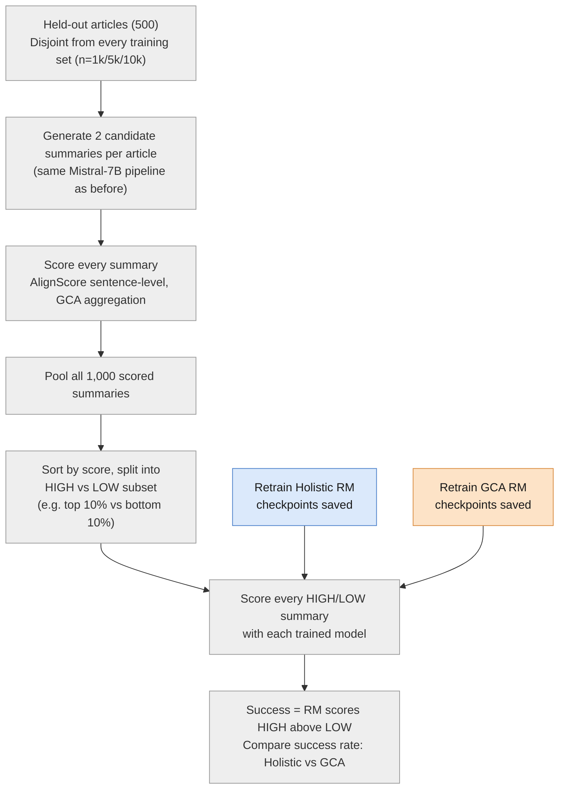
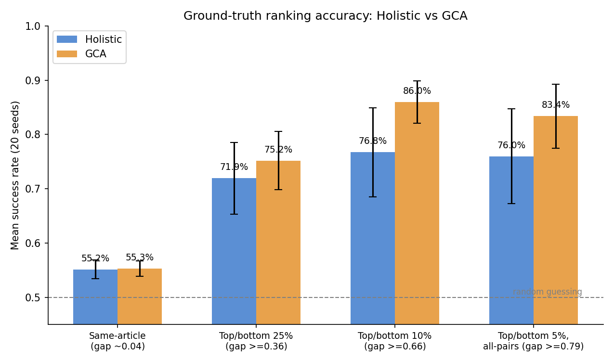
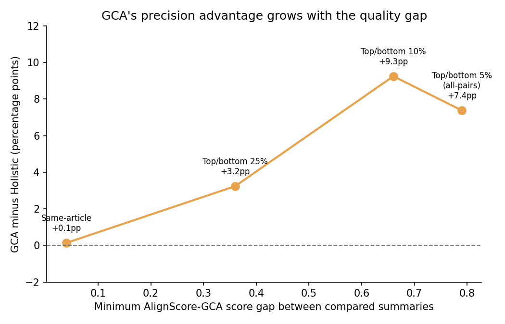
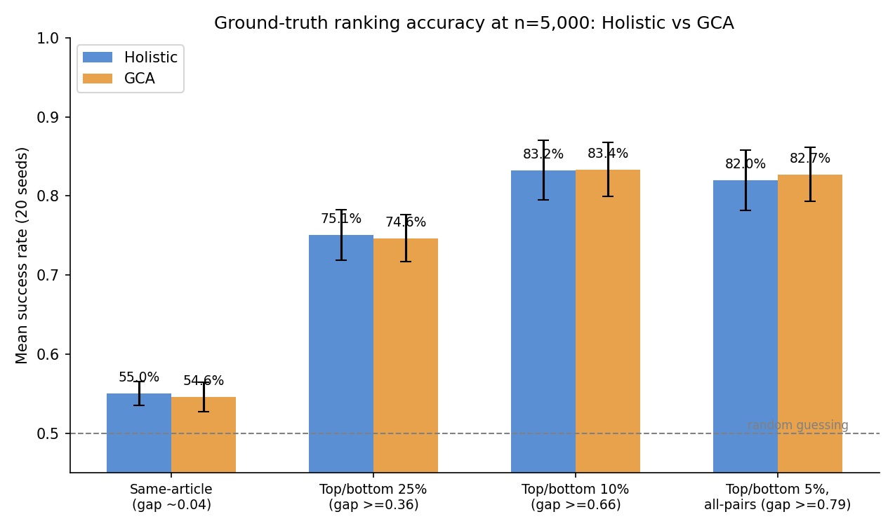
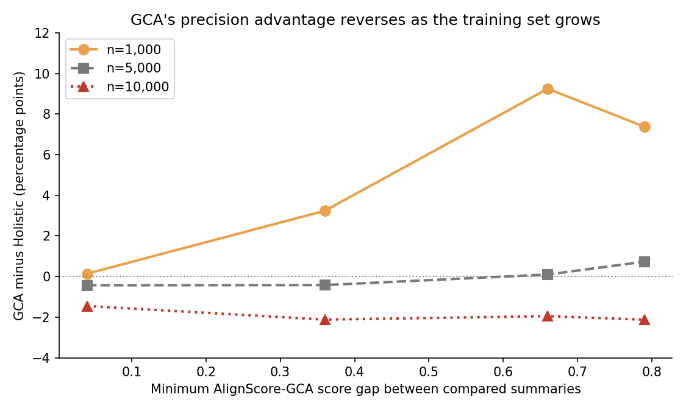

# Progress Update, 18 August 2026

Student: Muhammad Hasnat
Meeting: Tuesday, 18 August 2026

---

## Context

The last meeting raised a question about how precise the reward models
actually are, with two possible directions for the remaining weeks in a
follow-up email:

- Fine-tune small LLMs directly on the AlignScore signal.
- Keep the existing trained reward models and evaluate them against an
  independent ground truth built from AlignScore.

The first option is close to the DPO/policy fine-tuning approach already
tried and dropped in June, for the same reason: it's hard to tell whether a
change in output comes from the preference data or from the fine-tuning
itself. Given the deadline, this update follows the second option.

---

## Method

All 1,000 candidate summaries (500 articles, 2 candidates each) are pooled
and sorted by AlignScore-GCA score. **"Top X%"** is the highest-scoring X%
of that pool, **"bottom X%"** the lowest-scoring X% — a global split
across all articles, not a per-article comparison. Smaller X means a
smaller, more extreme subset with a bigger quality gap between the two
sides.

---

## Results

| Test | Summaries/side | Score gap | Holistic | GCA | Gap | p-value |
|---|---:|---:|---:|---:|---:|---:|
| In-distribution (11 Aug, for reference) | — | — | 53.0% | 56.9% | +3.9pp | <0.001 |
| Same-article pairs (initial test) | 500 pairs | ~0.04 | 55.2% | 55.3% | +0.1pp | 0.76 |
| Top 25% vs bottom 25% | 250 | ≥0.36 | 71.9% | 75.2% | +3.2pp | 0.19 |
| Top 10% vs bottom 10% | 100 | ≥0.66 | 76.8% | 86.0% | +9.3pp | <0.001 |
| Top 5% vs bottom 5% (all-pairs) | 50 | ≥0.79 | 76.0% | 83.4% | +7.4pp | 0.004 |

"Top X%" / "bottom X%" always refers to a slice of the same pool of 1,000
candidate summaries (500 held-out articles, 2 candidates each), sorted by
AlignScore-GCA score: top/bottom 25% is the best/worst 250 of that pool,
10% is the best/worst 100, 5% is the best/worst 50. Narrower percentage =
fewer summaries per side, but a bigger, more unambiguous quality gap
between the two sides being compared. 20 holistic and 20 GCA reward
models, retrained with checkpoints saved, were evaluated at each split.

**Run 0 — 11 August, for reference.** Models tested against their own
training-style labels, not this ground truth. GCA wins, significant
(p<0.001).

**Run 1 — same-article pairs.** Each article's own two candidates (500
pairs, no pooling) compared directly. Same model, similar temperatures, so
quality is naturally close — tied result (p=0.76), an equivalence check
rules out any real difference above ~1pp.

**Run 2 — top 25% vs bottom 25%.** Changed to global pooling: all 1,000
summaries sorted by score, best 250 vs worst 250 compared instead of
per-article pairs. GCA nominally ahead, not significant (p=0.19).

**Run 3 — top 10% vs bottom 10%.** Same pooling method as run 2, narrowed
from 250 to 100 summaries per side — a bigger quality gap (≥0.66 vs
≥0.36). GCA clearly ahead, significant (p<0.001).

**Run 4 — top 5% vs bottom 5%, all-pairs.** Narrowed further to 50 per
side (gap ≥0.79), and changed the evaluation itself: every high summary
checked against every low summary (2,500 pairs) instead of one random 1-1
pairing (50 pairs), to remove pairing-order noise. Confirms run 3: GCA
still significantly ahead (p=0.004), and accuracy settles around 76-86%
rather than climbing further.

On close calls, no difference. On clear-cut ones, GCA wins consistently,
confirmed under the most rigorous check. Neither model reaches 100%,
plausibly because of the 2,000-character article truncation used
throughout the pipeline (thesis Chapter 5), which limits how much evidence
either model can check against regardless of quality gap.

---

## Summary

Sentence-level scoring produces a more learnable training signal at small
scale (11 August) and a more precise reward model specifically on clear,
large quality differences (this update) — but not on subtle ones, and not
without an apparent ceiling in absolute accuracy that neither condition
breaks through.

---

## Scale comparison

The next question: does this precision advantage hold as the training set
grows, the way the 11 August learnability result didn't (significant at
n=1,000, absent at n=5,000/10,000)? Reward models were retrained at
n=5,000 with checkpoints saved and tested against the same held-out
ground truth. n=10,000 is still running; results to follow.

As before, "top X%" / "bottom X%" is a global split of the pooled 1,000
held-out candidate summaries by AlignScore-GCA score — top/bottom 25% is
the best/worst 250 of that pool, 10% the best/worst 100, 5% the best/worst
50. Same four conditions, same held-out set, only the training-set size
changes.

| Test | n=1,000 gap | n=5,000 gap | p-value (n=5,000) |
|---|---:|---:|---:|
| Same-article pairs | +0.1pp | -0.4pp | 0.29 |
| Top/bottom 25% | +3.2pp | -0.4pp | 0.69 |
| Top/bottom 10% | +9.3pp | +0.1pp | 0.94 |
| Top/bottom 5% (all-pairs) | +7.4pp | +0.7pp | 0.55 |

The advantage that was large and significant at n=1,000 (up to +9.3pp,
p<0.001) is gone at n=5,000 — every gap is within noise, none significant.
Same pattern as the 11 August learnability result: real at small scale,
absent once the training set grows. n=10,000 will confirm whether it
stays absent or reappears.

---

## Questions

1. GCA's precision advantage is real and significant on clear-cut
   comparisons but not on subtle ones, plateauing around 76–86% rather
   than approaching 100% — is this pattern a sufficient answer, or should
   the plateau itself be investigated further?
2. Is it enough to report all findings together (learnable; not more
   precise on close calls; more precise as the quality gap widens, up to
   a ceiling), or is more work needed before submission?
3. Anything else needed before the 3 September deadline?

---

## For reference

Full code: https://github.com/hasnat23/master-thesis-rlaif-gca

Pipeline: `scripts/03_prepare_ground_truth_subset.py`,
`slurm/generate_candidates_groundtruth.sh`, `slurm/build_ground_truth.sh`,
`slurm/retrain_for_ground_truth*.sh`, `slurm/evaluate_ground_truth_scale.sh`,
`analysis/build_biased_ground_truth.py`, `analysis/evaluate_ground_truth.py`,
`analysis/ground_truth_stats.py`.
Charts regenerated from committed evaluation data via `make_charts.py`.
