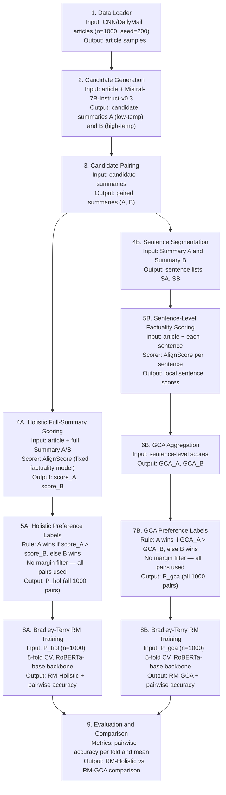

# Meeting Notes — 23 June 2026

**Student:** Muhammad Hasnat  
**Supervisors:** Dr. Zeyd Boukhers, Prof. Dr. Frank Hopfgartner | **Mentor:** Lingxiao Kong

---

## 1. Recap of Previous Meeting (2 June 2026)

The professor gave the following feedback on the pipeline:

1. **Remove the margin-based preference construction steps** (steps 5A and 7B) — the margin threshold makes the experiment unnecessarily complex and discards ~22% of usable pairs.
2. **Remove DPO fine-tuning** from the comparison — focus purely on the Bradley-Terry reward model comparison, which is the core IRL framing.
3. **Test with more candidates** (scale up from ~500 to ~1000 articles) to get more robust RM accuracy estimates.
4. **Validate each step before moving to the next** — check output size, score distributions, and decision counts at every stage to avoid wasting compute time.

All four points are addressed in this update.

---

## 2. Pipeline Changes (Based on Professor Feedback)

### What was removed

| Removed | Reason |
|---------|--------|
| Margin-based preference filtering (steps 5A / 7B) | Discarded 23% of holistic pairs and 21.5% of GCA pairs; adds complexity without clear benefit at this stage |
| DPO fine-tuning | Simplifies the experiment; core comparison is the reward model, not a downstream generation policy |

### Simplified pipeline

---

## 3. Step-by-Step Validation (Before Running Full Experiment)

### Step 1 check: Effect of removing the margin filter (existing n=200 data)

Before running new jobs, I reanalysed the existing 200-sample preference data locally to confirm the professor's suggestion is correct.

| Condition | margin=0.05 usable | margin=0 usable | Pairs recovered |
|-----------|-------------------|-----------------|-----------------|
| Holistic | 154/200 (77.0%) | 200/200 (100%) | +46 pairs (+30%) |
| GCA | 157/200 (78.5%) | 200/200 (100%) | +43 pairs (+27%) |

- With `margin=0`, every pair is usable because AlignScore is a continuous score — exact ties are essentially impossible.
- Agreement between holistic and GCA drops from 84.1% (filtered pairs only) to 78.5% (all pairs), which is expected since the easy near-tie cases are now included.
- Holistic score difference (mean=0.159) is smaller than GCA score difference (mean=0.239), suggesting GCA produces more distinguishable preferences — a useful observation for the analysis.

### Step 2 check: Candidate quality on 200-sample set

| Metric | Summary A (low-temp) | Summary B (high-temp) |
|--------|---------------------|----------------------|
| Mean AlignScore (holistic) | 0.733 | 0.653 |
| Mean GCA score | 0.407 | 0.334 |

The low-temperature summary (A) is consistently more factually consistent than the high-temperature one (B), which validates the candidate generation setup.

---

## 4. New Experiments Submitted (23 June 2026)

### Experiment setup

| Parameter | Value |
|-----------|-------|
| Dataset | CNN/DailyMail test split |
| New sample size | 1000 articles (seed=200, disjoint from seed=42 and seed=100) |
| Margin | 0 (all pairs used) |
| DPO | Removed |
| Backbone | FacebookAI/roberta-base |
| Training | 5-fold CV, 5 epochs, lr=2e-5, batch=8 |

### Jobs submitted

| Job | Description | Status |
|-----|-------------|--------|
| gen_1000 | Generate 1000 candidate pairs | Completed (Job 1335630) |
| prefs_1000 | Build preferences with margin=0 | Completed (Job 1335889) |
| train_rm_1000 | Train RM-Holistic and RM-GCA (5-fold CV) | Completed (Job 1335894) |

Jobs were executed as a dependency chain. During execution, filename-suffix and AlignScore runtime issues were fixed, rerun, and validated.

### Final RM results (n=1000, margin=0)

| Condition | Fold Accuracies | Mean Val Accuracy |
|-----------|------------------|-------------------|
| Holistic RM | 0.555, 0.600, 0.600, 0.500, 0.605 | **0.572** |
| GCA RM | 0.535, 0.615, 0.600, 0.540, 0.510 | **0.560** |

**Interpretation:**
- Holistic remains better than GCA at n=1000, but the gap is small (0.012 absolute).
- Both models are above random (0.50), indicating both preference sets carry learnable signal.
- With all pairs included (`margin=0`), GCA remains slightly noisier but still competitive.

### Scaling snapshot (available completed RM runs)

| Run setting | Holistic mean acc | GCA mean acc | Gap (H - GCA) |
|------------|-------------------|--------------|----------------|
| Previous RM run (reported on 19 May 2026) | 0.581 | 0.546 | 0.035 |
| New 1000-sample run (20 June 2026) | 0.572 | 0.560 | 0.012 |

Observation: at larger scale, GCA narrows the gap to holistic (0.035 -> 0.012), although holistic is still slightly better.

### Result vs expectation

- Expected: both RM conditions should remain above random and GCA may close the gap with scale.
- Observed: both conditions are above random; GCA is close but still below holistic at n=1000.
- Conclusion: scaling helped stability, but did not eliminate the holistic advantage.

---

## 5. Next Steps

### Update — 21 June 2026 (alpha = 0.0 validation complete)

After the 20 June run failures in `thesis_git` (environment/cache path issues), the same validation was rerun from the proven working `~/thesis` workspace.

#### Jobs completed

| Job ID | Name | Status | Notes |
|--------|------|--------|-------|
| 1336372 | prefs_alpha_0.0 | Completed (ExitCode 0) | Built 1000 holistic + 1000 GCA preferences with `alpha=0.0` |
| 1336378 | train_rm_alpha_0.0 | Completed (ExitCode 0) | 5-fold Bradley-Terry RM training on alpha=0.0 preferences |

#### Final RM results (alpha=0.0)

| Condition | Fold Accuracies | Mean Val Accuracy |
|-----------|------------------|-------------------|
| Holistic RM | 0.530, 0.610, 0.640, 0.545, 0.605 | **0.586** |
| GCA RM | 0.525, 0.575, 0.565, 0.555, 0.585 | **0.561** |

#### Comparison vs baseline (alpha=0.5)

| Metric | alpha=0.5 | alpha=0.0 | Delta |
|--------|-----------|-----------|-------|
| Holistic mean acc | 0.572 | 0.586 | **+0.014** |
| GCA mean acc | 0.560 | 0.561 | **+0.001** |
| Gap (Holistic - GCA) | 0.012 | 0.025 | **+0.013** (wider) |

Interpretation:
- `alpha=0.0` did **not** achieve the target `GCA > Holistic` in this full run.
- GCA improved only marginally, while Holistic improved more.
- The bottleneck appears to be beyond aggregation alone (training sensitivity / preference-signal quality).

### Next optimization phase (already launched)

To continue immediately after the alpha=0.0 validation result, a full hyperparameter search was launched on the new alpha=0.0 preference set.

| Job ID | Name | Status | Scope |
|--------|------|--------|-------|
| 1336398 (array 0-8) | hp_rm_a0 | Running | 9 configs: LR `[1e-5, 2e-5, 5e-5]` x epochs `[3, 5, 7]` |

Outputs are being written to:
- `~/thesis/outputs/hpsearch_alpha_0.0/lr*_ep*/`

#### Hpsearch completion snapshot

The array finished with a mixed outcome: 7 configs completed successfully and 2 failed early, but enough results were produced to identify a better GCA setting.

| Config | Holistic mean acc | GCA mean acc | Gap (GCA - Holistic) |
|--------|-------------------|--------------|-----------------------|
| `lr1e-5_ep5` | 0.586 | 0.570 | -0.016 |
| `lr1e-5_ep7` | 0.572 | **0.586** | **+0.014** |
| `lr2e-5_ep5` | 0.593 | 0.580 | -0.013 |
| `lr2e-5_ep7` | 0.602 | 0.574 | -0.028 |
| `lr5e-5_ep3` | 0.548 | 0.527 | -0.021 |
| `lr5e-5_ep5` | 0.554 | 0.539 | -0.015 |
| `lr5e-5_ep7` | 0.549 | 0.539 | -0.010 |

Best observed GCA result so far:
- `lr1e-5_ep7` with GCA mean accuracy `0.586`, which is `+0.014` above Holistic for that run.

#### Confirmation rerun (stability check)

A direct confirmation rerun of the best config (`lr1e-5_ep7`, same seed and setup) was completed:

| Run | Holistic mean acc | GCA mean acc | Gap (GCA - Holistic) |
|-----|-------------------|--------------|-----------------------|
| Hpsearch best (`lr1e-5_ep7`) | 0.572 | **0.586** | **+0.014** |
| Confirmation rerun (`confirm_lr1e-5_ep7`) | 0.577 | 0.560 | -0.017 |

Interpretation:
- The `lr1e-5_ep7` uplift did not reproduce on confirmation.
- Current evidence suggests high variance in fold outcomes rather than a stable GCA win from that hyperparameter choice.
- At this stage, there is no robustly confirmed `GCA > Holistic` configuration yet.

#### Confirmation job details

| Job ID | Name | Status | Runtime |
|--------|------|--------|---------|
| 1336415 | confirm_lr1e5ep7 | Completed (ExitCode 0) | 00:38:13 |

Key outcome from `rm_training_summary.json`:
- Confirmation mean accuracies: Holistic `0.577`, GCA `0.560` (GCA-Holistic = `-0.017`)
- Therefore the previous `+0.014` hpsearch gap was not stable in a repeat run.

### Next optimization phase launched (judge backend / mode)

Since the hpsearch uplift was not reproducible, optimization is now moving to AlignScore backend mode exploration.

| Job ID | Name | Status | Scope |
|--------|------|--------|-------|
| 1336427 (array 0-3) | mode_sweep_a0 | Running | Modes: `nli_sp`, `nli`, `bin_sp`, `bin` with alpha=0.0 and full RM retraining |

Outputs:
- Preferences per mode: `~/thesis/data/preferences_1000_alpha0_mode_<mode>/`
- RM results per mode: `~/thesis/outputs/mode_sweep_alpha0/mode_<mode>/`

#### Mode-sweep status update (mixed outcome and recovery)

Array `1336427` finished with mixed status:
- Successful modes: `nli_sp`, `bin_sp`, `bin`
- Failed mode: `nli` (task index 1)

Failure root cause from logs (`mode_sweep_a0_1336427_1.out`):
- Repeated `CUDA error: CUDA-capable device(s) is/are busy or unavailable`
- This caused all records to be skipped for the `nli` task and no usable preferences for that mode.

Recovery action taken:
- Resubmitted only failed task as job array `1336454` with `--array=1 --exclude=gpu0001`
- Recovery task is running on `gpu0002` to complete missing `nli` mode result.

### Immediate actionable next steps

1. Wait for job array `1336398` to complete.
2. Wait for recovery job `1336454_1` (`nli` mode) to finish.
3. Rank all 4 completed modes by GCA mean accuracy and GCA-Holistic gap.
4. If one mode is clearly better, run a direct confirmation repeat for that mode.
