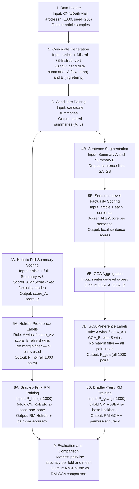

# Meeting Notes — 23 June 2026

**Student:** Muhammad Hasnat  
**Supervisors:** Dr. Zeyd Boukhers, Prof. Dr. Frank Hopfgartner | **Mentor:** Lingxiao Kong

---

## 1. Recap of Previous Meeting (2 June 2026)

The professor gave the following feedback on the pipeline:

1. **Remove the margin-based preference construction steps** (steps 5A and 7B) — the margin threshold makes the experiment unnecessarily complex and discards ~22% of usable pairs.
2. **Remove DPO fine-tuning** from the comparison — focus purely on the Bradley-Terry reward model comparison, which is the core IRL framing.
3. **Test with more candidates** (scale up from ~500 to ~1000 articles) to get more robust RM accuracy estimates.
4. **Validate each step before moving to the next** — check output size, score distributions, and decision counts at every stage to avoid wasting compute time.

All four points are addressed in this update.

---

## 2. Pipeline Changes (Based on Professor Feedback)

### What was removed

| Removed | Reason |
|---------|--------|
| Margin-based preference filtering (steps 5A / 7B) | Discarded 23% of holistic pairs and 21.5% of GCA pairs; adds complexity without clear benefit at this stage |
| DPO fine-tuning | Simplifies the experiment; core comparison is the reward model, not a downstream generation policy |

### Simplified pipeline

---

## 3. Step-by-Step Validation (Before Running Full Experiment)

### Step 1 check: Effect of removing the margin filter (existing n=200 data)

Before running new jobs, I reanalysed the existing 200-sample preference data locally to confirm the professor's suggestion is correct.

| Condition | margin=0.05 usable | margin=0 usable | Pairs recovered |
|-----------|-------------------|-----------------|-----------------|
| Holistic | 154/200 (77.0%) | 200/200 (100%) | +46 pairs (+30%) |
| GCA | 157/200 (78.5%) | 200/200 (100%) | +43 pairs (+27%) |

- With `margin=0`, every pair is usable because AlignScore is a continuous score — exact ties are essentially impossible.
- Agreement between holistic and GCA drops from 84.1% (filtered pairs only) to 78.5% (all pairs), which is expected since the easy near-tie cases are now included.
- Holistic score difference (mean=0.159) is smaller than GCA score difference (mean=0.239), suggesting GCA produces more distinguishable preferences — a useful observation for the analysis.

### Step 2 check: Candidate quality on 200-sample set

| Metric | Summary A (low-temp) | Summary B (high-temp) |
|--------|---------------------|----------------------|
| Mean AlignScore (holistic) | 0.733 | 0.653 |
| Mean GCA score | 0.407 | 0.334 |

The low-temperature summary (A) is consistently more factually consistent than the high-temperature one (B), which validates the candidate generation setup.

---

## 4. New Experiments Submitted (23 June 2026)

### Experiment setup

| Parameter | Value |
|-----------|-------|
| Dataset | CNN/DailyMail test split |
| New sample size | 1000 articles (seed=200, disjoint from seed=42 and seed=100) |
| Margin | 0 (all pairs used) |
| DPO | Removed |
| Backbone | FacebookAI/roberta-base |
| Training | 5-fold CV, 5 epochs, lr=2e-5, batch=8 |

### Jobs submitted

| Job | Description | Status |
|-----|-------------|--------|
| gen_1000 | Generate 1000 candidate pairs (est. 5-6h) | Submitted |
| prefs_1000 | Build preferences with margin=0 (est. 15-20 min) | Queued (dependency) |
| train_rm_1000 | Train RM-Holistic and RM-GCA (est. 30-60 min) | Queued (dependency) |

Jobs are submitted as a dependency chain — each starts automatically after the previous one completes.

### Expected results

Based on the pattern from the existing 500-sample run (holistic 58.1%, GCA 54.6%):
- With 1000 samples and no margin filtering, both accuracies should improve.
- The key question is whether GCA accuracy closes the gap with holistic at larger scale, or whether the signal remains noisier.

---

## 5. Next Steps

**Immediate (pending job results):**
1. Collect results from train_rm_1000 job
2. Compare RM-Holistic vs RM-GCA per-fold accuracy at n=200, n=500, n=1000 (scaling analysis)
3. Start disagreement-case analysis on the pairs where holistic and GCA disagree

**Once results are in:**
1. If GCA accuracy improves significantly — explore better GCA aggregation (e.g., min-based penalty for lowest-faithfulness sentence)
2. If gap remains — the thesis argument shifts to: GCA produces different, harder-to-learn preferences, which motivates future work on aggregation strategy
3. Begin thesis write-up — introduction, related work, and method sections are not blocked on results

**Open questions for today:**
- Should we also test a `margin=0.02` variant (partial filtering) as an ablation point between the original 0.05 and the new 0 setting?
- Is it worth running a quick experiment where GCA aggregation uses `min(sentence scores)` instead of the current weighted sum, to more aggressively penalize low-faithfulness sentences?
- Timeline: is the experimental scope now sufficient to start writing the results section even before the 1000-sample results are in?
