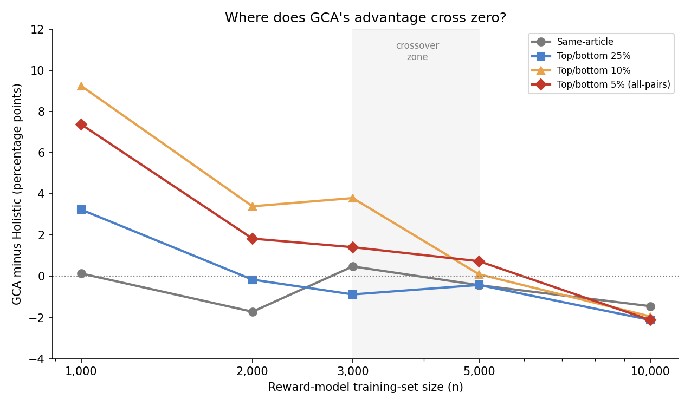

# Progress Update, 25 August 2026

Student: Muhammad Hasnat
Meeting: Tuesday, 25 August 2026

---

> **TL;DR:** GCA beats Holistic only in a specific, narrow situation:
> small training data **and** two summaries that clearly differ in
> quality. Push past ~n=3,000-5,000 and that advantage disappears, then
> flips into a small edge for Holistic instead. We tested the two most
> obvious explanations for *why* it flips -- both were ruled out. The
> real "why" is still unknown and is flagged honestly as future work.

---

## Context

The 18 August update found that GCA's ground-truth ranking precision advantage
over Holistic reverses as the reward model's training set grows: significant
GCA advantage at n=1,000 (up to +9.3pp), gone at n=5,000, and a significant
Holistic advantage at n=10,000. The last meeting asked for this to be closed
out with one of: make GCA win consistently, find and test a hypothesis for
why it doesn't win at scale, or locate the crossover point between the small-
and large-scale results. This update covers what was tested this week.

---

## Summary

Two candidate explanations for the reversal were tested this week. Both
are now full findings in the thesis, not just side notes -- they are
covered in the Results, Discussion, and Conclusion chapters, and in the
Abstract and Introduction too:

- **Near-tie training pairs** -- the idea that GCA's sentence scoring
  produces more "coin-flip" training pairs than Holistic, and fitting
  that noise at scale hurts GCA. Rejected: the near-tie fraction is
  virtually identical between conditions at every scale (24.2% vs 24.2%
  at n=10,000), and GCA actually has *more* near-ties at n=1,000 -- where
  GCA wins. Opposite of the prediction.

- **Length/sentence-count shortcut** -- the idea that GCA increasingly
  leans on summary length as a proxy for quality as training data grows.
  Rejected: the GCA-vs-Holistic gap in length-correlation should peak at
  n=10,000 (where GCA loses) if this were true; instead it peaks at
  n=3,000 and nearly vanishes at n=10,000. Opposite of the prediction
  again.

**Where the thesis ends up** (RQ4, the headline finding of the whole
project): GCA is significantly more precise than Holistic at n=1,000 on
comparisons with a real quality gap (up to +9.25pp, p<0.001), the two are
indistinguishable at n=5,000, and Holistic is significantly *more*
precise than GCA at n=10,000 on 3 of 4 constructions (p=0.010-0.036). In
between, nothing is distinguishable from zero, so the crossover is a null
region around n=3,000-5,000 rather than a single point. Two plausible
mechanical explanations for that reversal have been tested and
eliminated. The actual mechanism is left as an open question for future
work -- the thesis doesn't pretend to have solved it, and closes RQ4
honestly with "the effect is real and its regime is mapped; why it
reverses is not yet known."

That's the landing point: a confirmed, bounded, well-characterized
effect, with two dead ends clearly marked so nobody wastes time retesting
them.

---

## Hypothesis test: near-tie training pairs

Leading hypothesis: GCA's sentence-level aggregation produces more
near-zero-margin ("noise-level") preference pairs than Holistic's single
whole-summary score, and fitting that noise at large training-set sizes is
what hurts precision on the held-out ground truth.

Checked directly against the existing preference files, which already store
each pair's score gap — no new training or scoring needed. **Falsified**: the
fraction of near-tie pairs (gap < 0.05) is essentially identical between GCA
and Holistic at every scale (n=10,000: 24.2% vs 24.2%, 1,103 vs 1,103 pairs
exactly). At n=1,000, where GCA wins, GCA actually has *more* near-ties than
Holistic (26.5% vs 20.5%) -- the opposite of what the hypothesis predicts.
This mechanism does not explain the reversal.

---

## Hypothesis test: length/sentence-count shortcut

Second candidate: GCA-trained reward models learn to rely on summary length
or sentence count as a shortcut for quality, and lean on it more heavily as
training data grows, in a way that doesn't transfer to the ground truth's
cross-article comparisons. Tested by scoring every ground-truth summary with
the already-trained checkpoints at n=2,000, n=3,000, and n=10,000, and
correlating each model's predicted score against summary length and
sentence count -- no new training needed, only inference on checkpoints
already on disk.

| Scale | Holistic r(score, length) | GCA r(score, length) | Gap (GCA − Hol.) |
|---|---:|---:|---:|
| n=2,000 | −0.037 | −0.046 | −0.009 |
| n=3,000 | −0.089 | −0.132 | −0.043 |
| n=10,000 | −0.198 | −0.201 | −0.003 |

(Same pattern for sentence count: gaps of −0.013, −0.032, −0.012 respectively.
Negative throughout means both models score *shorter* summaries higher, not
longer ones.)

**Falsified.** If GCA increasingly relied on this shortcut more than
Holistic as training data grew, the gap should be largest at n=10,000 —
exactly where GCA starts losing. Instead the gap peaks at n=3,000 and nearly
vanishes at n=10,000: the two models converge to almost identical
length-reliance right at the scale where the reversal happens. What is real
and worth noting separately: *both* models become substantially more
correlated with summary length as training data grows (roughly 5× larger by
n=10,000 for each), which may partly explain the low absolute ceiling
neither model breaks, but it does not differentiate GCA from Holistic and
so cannot be the reversal's mechanism.

This is the second candidate mechanism tested and ruled out this week.

---

## Crossover point

Retrained at two intermediate scales, n=2,000 and n=3,000, to locate where
the advantage crosses from GCA-favoring to Holistic-favoring. Both training
sets are exact subsets of the existing n=5,000/10,000 draws (verified
empirically), so no new candidate generation or AlignScore scoring was
needed -- only filtering the existing preference files by article ID, then
retraining and evaluating. 5 seeds per scale, not 20, to keep this
supplementary check fast this close to the deadline.

| Test | n=1,000 | n=2,000 | n=3,000 | n=5,000 | n=10,000 |
|---|---:|---:|---:|---:|---:|
| Same-article pairs | +0.1pp | -1.7pp | +0.5pp | -0.4pp | -1.5pp |
| Top/bottom 25% | +3.2pp | -0.2pp | -0.9pp | -0.4pp | -2.1pp |
| Top/bottom 10% | +9.3pp | +3.4pp | +3.8pp | +0.1pp | -2.0pp |
| Top/bottom 5% (all-pairs) | +7.4pp | +1.8pp | +1.4pp | +0.7pp | -2.1pp |

(All values are the GCA-minus-Holistic gap. n=1,000/5,000/10,000 are 20-seed
means; n=2,000/3,000 are 5-seed means, so noisier -- see the same-article
row, which stays close to zero throughout with no real signal at any scale.)

For the three conditions with a real effect at n=1,000 (top/bottom
25%/10%/5%), the decline from n=1,000 to n=10,000 is consistent and close to
monotonic: a large GCA advantage at n=1,000, roughly half that by
n=2,000-3,000, near zero at n=5,000, and a small but significant Holistic
advantage by n=10,000.

The crossover is best described as a **region, not a point**. Significance
pins it down only at the two ends: GCA is significantly ahead at n=1,000,
Holistic is significantly ahead at n=10,000, and *nothing* in between
(n=2,000, 3,000, 5,000) is distinguishable from zero in either direction.
The point estimates cross zero at different places depending on the
condition (top/bottom 25% is already slightly negative by n=2,000, while
10% and 5% stay marginally positive at n=5,000), which at 5 seeds is well
inside normal run-to-run noise. So the honest statement is that the
advantage **passes through a null region around n=3,000-5,000**, rather
than flipping at one identifiable value.

---

## Conclusion

Pulling the three pieces above (near-tie test, shortcut test, crossover
scan) into one story:

**When GCA wins.** GCA beats Holistic on the ground truth, but only when
two things are both true at the same time: the reward model was trained
on a small amount of data (up to a few thousand examples), **and** the
two summaries being compared are clearly different in quality, not
near-identical. Inside that window, the advantage is large and
consistent: up to **+9.3pp at n=1,000**, still **+3.4 to +3.8pp** at
n=2,000-3,000, on the same type of comparison.

**When it stops winning -- for two separate reasons.**
- *Reason 1: the comparison is too easy to call.* On same-article pairs
  (summaries that are already close in quality), GCA and Holistic are
  statistically indistinguishable at *every* scale we tested, from
  n=1,000 to n=10,000. GCA never had an edge here, at any size.
- *Reason 2: there is too much training data.* Even on the easiest
  comparisons, where GCA's advantage is largest, growing the training set
  erases it: **+9.3pp** at n=1,000 → about a third of that by
  n=2,000-3,000 → roughly zero at n=5,000 → a small but real advantage
  for **Holistic** by n=10,000 (**-2.0pp**).

So "GCA wins" is not a general rule -- it only holds in one specific
corner of the experiment, and that corner is now precisely mapped rather
than guessed at.

**Why does it flip, not just fade?** That's the more interesting
question, and it's what the two hypothesis tests above (near-tie pairs,
length/sentence-count shortcut) were built to answer. Both made a clear,
checkable prediction about *where* the effect should be strongest if the
hypothesis were true, and in both cases the actual data went the opposite
direction -- a stronger kind of rejection than simply "no effect found."
Both are ruled out; see those two sections for the numbers.

**What's still unknown.** Ruling out two explanations did not produce a
confirmed one. The leading untested idea (see Future Work below) is that
GCA's sentence-by-sentence scoring lets the reward model pick up on
quirks specific to how *one particular article's* two summaries happen to
differ -- quirks that don't carry over when comparing summaries written
about *different* articles, which is what the ground-truth test actually
does. This idea was not tested, so it stays a guess, not a finding.

> **Bottom line:** the effect is real, we now know exactly where it holds
> and where it doesn't, and the two most obvious explanations for why it
> flips (rather than just fades) have been directly tested and ruled out.
> The mechanism itself is still open -- and that is an honest, complete
> place to close RQ4.

---

## Future work

- Two candidate mechanisms for the reversal are now ruled out (near-tie
  training pairs; length/sentence-count shortcut). Remaining candidates are
  less mechanical and harder to test quickly: e.g. whether GCA's
  sentence-level aggregation lets the reward model fit article-specific,
  within-pair artifacts that do not generalize to the ground truth's
  cross-article comparisons, as opposed to holistic's single coarser score.
- The n=2,000/3,000 points used 5 seeds instead of 20; re-running them at
  20 seeds would tighten the crossover estimate if time allows.

---

## Questions

1. Does the crossover region (n=3,000-5,000) combined with the two ruled-out
   hypotheses (near-tie pairs, length/sentence-count shortcut) give enough
   of a closing story for this section of the thesis, or is further
   investigation into the *why* expected before submission?
2. Is it acceptable to close with "the effect is real, bounded, and we
   ruled out two plausible mechanisms" without a confirmed explanation, or
   should more candidates be tested before the deadline?
3. Anything else needed before the 3 September submission?

---

## For reference

Full code: https://github.com/hasnat23/master-thesis-rlaif-gca

This update builds directly on the 18 August results:
[progress-updates/18-08-2026/README.md](../18-08-2026/README.md).
